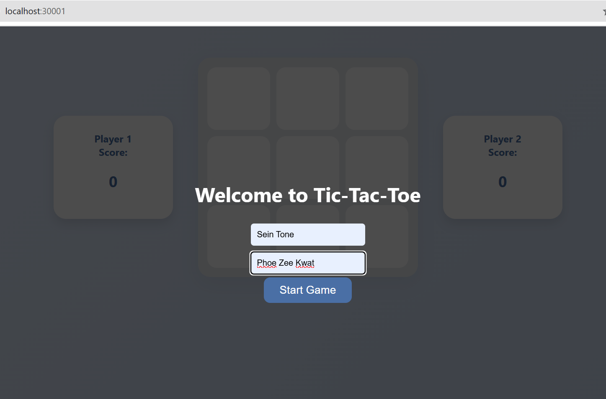
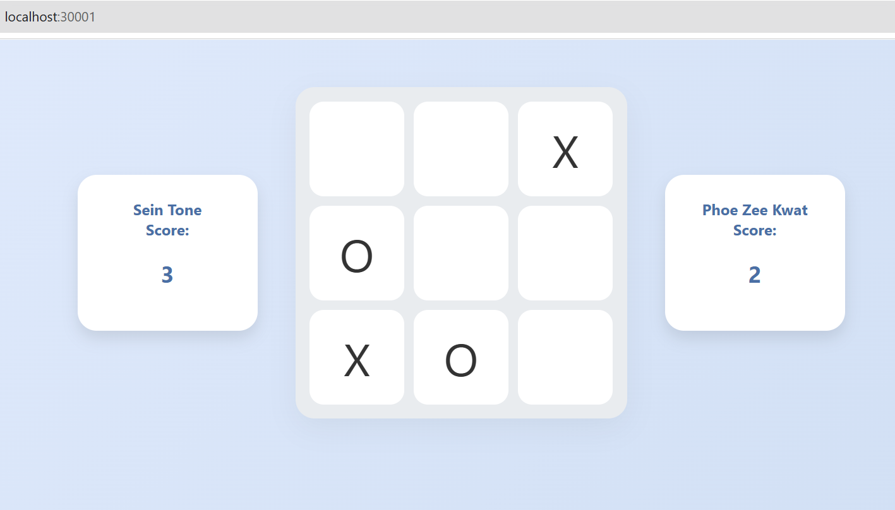

# Tic-Tac-Toe Real-Time Game

A real-time, 2-player Tic-Tac-Toe game built with **Python (Flask)** and **Socket.IO**. Designed for real-time interaction and containerized for modern cloud deployment.




## Features
* **Real-time Gameplay:** Bi-directional communication using WebSockets.
* **Live Scoring:** Track scores across multiple sessions.
* **Custom Personalization:** Players enter their own names before starting.

## Tech Stack
* **Backend:** Python, Flask, Flask-SocketIO
* **Frontend:** HTML, CSS, JavaScript
* **DevOps:** Docker, Kubernetes

## Deployment
This project is containerized for easy deployment to any Kubernetes cluster.

### Running Locally (Docker Desktop & Kubernetes)
```bash
# Build the image
docker build -t eithiriphyo/tictactoe:local .

# Deploy to Kubernetes
- kubectl apply -f manifest/deployment.yaml
- kubectl apply -f manifest/service.yaml


# Key Learnings
- Real-time State: Managed complex game states using WebSocket events.

- Containerization: Mastered Dockerizing Python applications and optimizing image layers.

- Orchestration: Troubleshot and resolved CrashLoopBackOff errors and Kubernetes image caching issues.
